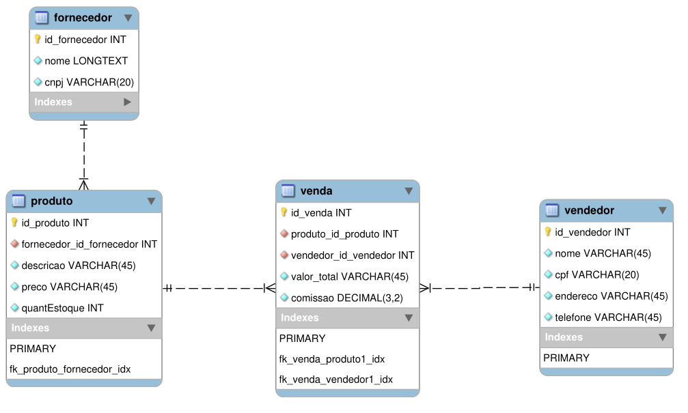

# tkinter_playground

> This repository shows results of the hard and bumpy road I faced while creating a GUI for a python program. 

This program has a fully operational CRUD for evey table and also has funcionalities to export pdf reports from sells and sellers

# Recreating the environment:

- The `./mysql/mysql_dump.sql` file includes both DDL/DML creating tables and inserting mock data.

  
  

- You can also create it by yourself executing the scripts inside `./mysql/ddl_dml` folder respecting dependencies depicted in the following diagram.

  
  

- You can also generate *N* unique sells by filling the `Código`(code) and using the option under the `Automação`(automation) tab.

