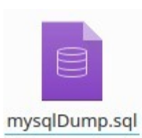
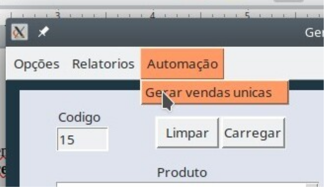

# tkinter_playground

> This repository shows results of the hard and bumpy road I faced while creating a GUI for a python program. 

- The `./mysql/mysql_dump.sql` file already has DDL/DML doing both creation of tables and insertion of mock data

  
  

- You can also generate *N* unique sells by filling the `Código`(code) and option under the `Automação`(automation) tab

